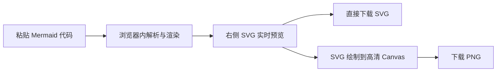

# Mermaid 图像工坊

一个中文界面的本地 Mermaid 图片工具。粘贴 Mermaid 代码后，可在浏览器中实时预览并导出高清 PNG 或 SVG；代码和图片不会上传到服务器。

在线使用：[https://duolabmeng6.github.io/mermaid_to_png/](https://duolabmeng6.github.io/mermaid_to_png/)

## 本地运行

```bash
pnpm install
pnpm dev
```

根据终端提示打开本地地址即可。生产构建：

```bash
pnpm run build
pnpm preview
```

## GitHub Pages 发布

推送到 `main` 分支后，GitHub Actions 会自动执行测试、生产构建并发布 `dist` 到 GitHub Pages。Pages 使用仓库子路径 `/mermaid_to_png/`，本地开发仍使用根路径 `/`。

## 工作方式



## 已支持

- 中文双栏界面：左侧代码，右侧图片。
- Mermaid 语法实时检查，出错时保留上一次有效预览。
- PNG 1×、2×、3×、4× 清晰度选择，并显示最终像素尺寸。
- PNG/SVG 主题背景、白色背景与透明背景。
- 默认、简洁、森林、深色四种 Mermaid 主题。
- 流程图、时序图、类图、甘特图示例。
- 草稿和导出设置保存在当前浏览器。
- 超大 Canvas 尺寸保护，避免导出时占用过多内存。

## 技术说明

项目使用 Vue 3、TypeScript、Vite 和 Mermaid。PNG 导出遵循 Mermaid 官方 Live Editor 采用的纯前端方案：将 Mermaid 生成的 SVG 加载为浏览器图片，再绘制到高倍率 Canvas，最后通过 `toBlob()` 下载。项目不需要 Hono、数据库或任何远程渲染服务。
