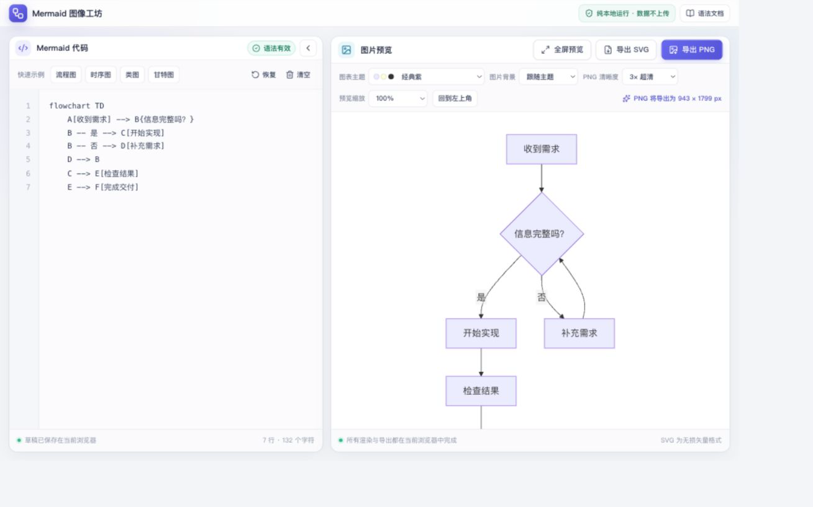
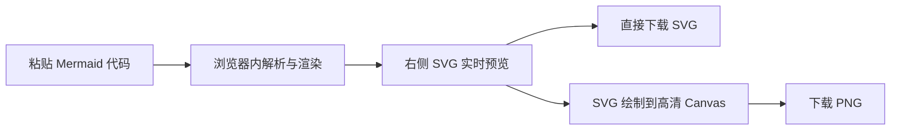

# Mermaid 图像工坊

一个中文界面的本地 Mermaid 图片工具。粘贴 Mermaid 代码后，可在浏览器中实时预览并导出高清 PNG 或 SVG；代码和图片不会上传到服务器。

## 在线使用

无需安装，直接访问：[https://my.rongyiapi.com/mermaid_to_png/](https://my.rongyiapi.com/mermaid_to_png/)

[](https://my.rongyiapi.com/mermaid_to_png/)

## 本地运行

```bash
pnpm install
pnpm dev
```

根据终端提示打开本地地址即可。生产构建：

```bash
pnpm run build
pnpm preview
```

## GitHub Pages 发布

推送到 `main` 分支后，GitHub Actions 会自动执行测试、生产构建并发布 `dist` 到 GitHub Pages。Pages 使用仓库子路径 `/mermaid_to_png/`，本地开发仍使用根路径 `/`。

## 工作方式



## 已支持

- 中文双栏界面：左侧代码，右侧图片。
- Mermaid 语法实时检查，出错时保留上一次有效预览。
- PNG 1×、2×、3×、4× 清晰度选择，并显示最终像素尺寸。
- PNG/SVG 主题背景、白色背景与透明背景。
- 默认、简洁、森林、深色四种 Mermaid 主题。
- 流程图、时序图、类图、甘特图示例。
- 草稿和导出设置保存在当前浏览器。
- 超大 Canvas 尺寸保护，避免导出时占用过多内存。

## 技术说明

项目使用 Vue 3、TypeScript、Vite 和 Mermaid。PNG 导出遵循 Mermaid 官方 Live Editor 采用的纯前端方案：将 Mermaid 生成的 SVG 加载为浏览器图片，再绘制到高倍率 Canvas，最后通过 `toBlob()` 下载。项目不需要 Hono、数据库或任何远程渲染服务。

## 调整 PNG 排版

在预览工具栏点击 **图片排版设置**，可选择自动、紧凑、舒展、大字方案，再微调文字宽度、节点留白和字号；流程图还支持节点间距与层级间距。排版调整支持独立撤销、重做，关闭面板后记录仍保留，刷新页面后记录清空。

- 文字差一点就换行时，先增加文字宽度；手动插入的换行仍保留。
- 通过字号改变文字大小，通过 PNG 清晰度改变输出像素倍率，两者作用不同。
- 图内空间使用节点留白、节点间距调节，图片外围空间使用 PNG 留白调节。
- 点击 **检查 PNG** 可查看实际生成的图片，支持适应窗口和原始像素查看，并可直接下载同一张 PNG。
- 排版参数自动保存到当前浏览器，也可以通过面板导出、导入 JSON 配置。配置仅包含排版参数，不含源码、主题或 PNG 背景、倍率、外围留白。
- 设置作用于全部图表，预览、缩略图和导出使用同一渲染配置。仅使用 Mermaid 原生选项，源码中显式配置的样式可能覆盖界面设置。
- 超出浏览器 Canvas 限制时，工具栏提前显示原因并禁用当前 PNG 导出；降低倍率后再试。

## 可编辑文档与恢复

顶部文档栏支持新建脑图、重命名、切换文档、另存副本，以及可编辑 JSON 文档导入导出。每份文档包含源码、主题、排版、图片背景、PNG 倍率和外围留白；导入会创建新文档，不覆盖已有内容。首次启用文档库时会迁移原有浏览器草稿。

文档自动保存到本地浏览器，最多保留 50 份。每次保存前保留上一次有效文档库作为恢复备份；“恢复备份”会为当前文档创建恢复副本。浏览器存储容量不足或其他标签页更新文档库时会明确提示，当前内存中的内容仍可导出备份。浏览器数据可能被清理，重要内容请定期导出文件。

当前图表支持节点文字搜索，Enter/Shift+Enter 或上下按钮可依次定位匹配节点。搜索输入不会写入图片。

## 节点外观与分支顺序

- 流程图：右键节点选择“设置节点外观”，可以调整填充色、边框色、文字色、字号和边框粗细；多选后也可以批量设置。外观写入 Mermaid 原生 `style` 语句，保留已有手写样式，可通过源码撤销恢复。“恢复默认”只移除本面板生成的外观。
- 思维导图：排序模式支持把整个分支拖到同级节点前方；右键“分支上移/下移”可以移动到同级首尾位置。跨级移动仍使用“移动到其他父节点”，子树保持完整。
- 文档管理：通过顶部“管理文档”将当前文档移入回收站，支持恢复；回收站最多保留 50 份，可在确认后清空。重要文档请先恢复并导出文件备份。

## 折叠脑图后导出

脑图节点右键菜单支持“折叠下级分支”和“展开分支”。折叠内容保存为 Mermaid 注释，不会丢失；切换文档、导出可编辑文档或移动分支后仍可展开。PNG 和 SVG 只包含当前展开的图表内容，导出完整图表前可点击工具栏“展开全部”。折叠状态的虚线提示只用于编辑界面，不会出现在图片中。节点搜索只查找当前展开的节点。

## 大纲与补充资料

脑图工具栏提供“大纲”视图，与画布选择联动。上下键浏览、左右键展开或折叠、Home/End 定位首尾；点击节点文字可将画布滚动到对应位置。触屏或不方便右键时，选中节点后使用工具栏“节点操作”。

脑图与流程图节点都支持右键“备注与链接”。备注保存在源码注释中，随可编辑文档导出，默认不显示到 PNG。资料链接仅接受 HTTP/HTTPS 地址，不接受脚本、文件协议或带账号密码的链接。删除节点时对应备注也会移除；脑图移动与折叠操作保留备注。

渲染调度优先处理主预览，其次处理批量导出和缩略图。尚未开始的过期任务会取消，已经运行的 Mermaid 渲染保持串行结束，避免主题或配置串到其他图表。本机 Chromium 验收中，101 个脑图节点约 1.8 秒完成渲染；实际耗时随图形复杂度和设备变化。完整验收范围见 [改进记录](docs/IMPLEMENTATION_STATUS.md)。

## 编辑连接线文字

流程图中双击连接线上的文字或线条，或者右键选择“编辑连接线文字”。支持中文、换行、添加或清空标签；清空只移除文字，连接线仍保留。修改写回 Mermaid 源码，支持撤销，预览与 PNG/SVG 导出同步。同一对节点之间的多条连线分别定位。不能安全定位的特殊语法会提示在源码中编辑。
